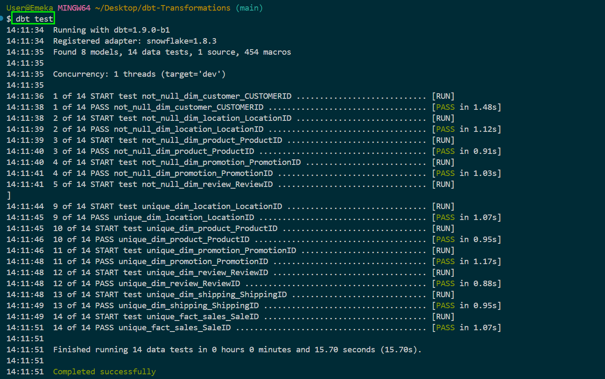

# Comprehensive Data Pipeline Documentation for Sales Data Analysis Project

## Table of Contents

1. [Project Overview](#project-overview)  
2. [Tools and Technologies Used](#tools-and-technologies-used)  
3. [Step-by-Step Process](#step-by-step-process)  
   - [Data Creation and Storage in AWS S3](#data-creation-and-storage-in-aws-s3)  
   - [Staging Data in Snowflake](#staging-data-in-snowflake)  
   - [Transforming Data using dbt](#transforming-data-using-dbt)  
   - [Star Schema Design](#star-schema-design)  
   - [Connecting Snowflake to Tableau](#connecting-snowflake-to-tableau)  
   - [Creating a Live Dashboard](#creating-a-live-dashboard)  
   - [Business Insights and KPIs](#business-insights-and-kpis)  
   - [Automation with GitHub Actions](#automation-with-github-actions)  
4. [Conclusion](#conclusion)  

---

## Project Overview

This project demonstrates an **end-to-end full data process**, covering the entire workflow from raw data ingestion in AWS S3 to generating business insights with live dashboards in Tableau. The key steps include data staging, transformation, modeling, and visualization, all while maintaining a live connection between Snowflake and Tableau. The project leverages several modern tools and technologies to build a **data pipeline** that is scalable, efficient, and capable of producing actionable insights in real-time.

The project is structured to follow best practices for **data engineering**, **data analysis**, and **data science**, providing a holistic solution to handling and transforming raw sales data into **structured fact and dimension tables**. The resulting live dashboard offers dynamic reporting capabilities, enabling stakeholders to track **KPIs** such as **Total Profit**, **Profit by Location**, and **Profit Over Time**.

---

## Tools and Technologies Used

- **AWS S3**: Cloud-based storage service used for storing the raw semi-structured sales data in a secure and scalable environment.
- **Snowflake**: Cloud-based data warehouse where the raw data is staged and transformed into structured data for analysis.
- **dbt (Data Build Tool)**: Transformation layer used to convert the raw sales data into **fact** and **dimension tables** in Snowflake. dbt allows version control and reproducibility of the data transformations.
- **SQL and Python**: Used within dbt models for writing transformation logic, creating tests, and validating the quality of data.
- **Tableau**: Visualization tool used to build live, interactive dashboards that provide real-time insights into sales and profitability.
- **GitHub Actions**: CI/CD tool used to automate the testing, building, and deployment of dbt models, ensuring that the pipeline is continuously integrated and delivered without manual intervention.

---

## Step-by-Step Process

### Data Creation and Storage in AWS S3

The sales data is stored in AWS S3 at the location: **s3://emeka-market-raw-sales-data/sample_raw_sales_data.csv**. This raw data is semi-structured and contains key attributes such as:

- **SaleID**: Unique identifier for each sale.
- **ProductID**: Identifier for the products sold.
- **CustomerID**: Identifier for the customer.
- **Quantity**: The number of products sold.
- **SaleDate**: The date the sale was made.
- **LocationID**: Identifier for the store or region where the sale occurred.
- Additional fields related to payment, shipping, promotion, and review details.

The raw data is uploaded into the S3 bucket, acting as the foundation for the pipeline. This ensures the scalability and flexibility of storage, supporting large datasets with minimal management effort.

**Screenshot**: 

---

### Staging Data in Snowflake

Once the data is stored in S3, Snowflake is used as the data warehouse to stage and process the raw data. The **COPY INTO** command in Snowflake facilitates loading the data from S3 into the **RAW_SALES_DATA** schema of the **EMEKA_MARKET_DATA** database.

**Steps to stage data**:
1. **Create a staging table**: A staging table is created in Snowflake to temporarily hold the raw data.
2. **Copy data from S3**: Snowflake’s COPY INTO command is used to ingest the data from the S3 bucket into the staging table.
3. **Validation**: After loading, data integrity checks are performed to ensure successful ingestion.

**Snowflake Outputs**:  

---

### Transforming Data using dbt

The transformation process is handled using **dbt**. This includes cleaning the data, transforming it into structured tables, and following the **star schema** design for better performance.

- **Fact Table**: Aggregates sales data with calculated fields like **Total Sales**, **Total Profit**, and **Total Quantity**.
- **Dimension Tables**: Product, Customer, Location, and other related data are extracted into dimension tables to store descriptive attributes, optimizing reporting capabilities.

The transformations are defined using **SQL and Python** in dbt models. A notable aspect of this project is that the dbt models are configured to be **incremental**. Each model uses `materialized='incremental'`, which allows only the new or changed records to be processed and inserted into the existing tables during each run.

#### Importance of Incremental Models

The use of incremental models is crucial for several reasons:

1. **Performance**: Incremental processing significantly reduces the time and resources required for data transformation. Instead of refreshing the entire table each time, only new data is processed, leading to faster execution times.
  
2. **Cost-Effectiveness**: In cloud environments like Snowflake, reducing compute time translates into cost savings. Incremental updates minimize the resource usage and expenses associated with running transformations.

3. **Data Freshness**: Incremental models ensure that the data is updated in near real-time. This is particularly beneficial for applications needing up-to-date information without the latency of a full refresh.

4. **Error Handling**: By processing only the latest changes, it becomes easier to identify and address errors in the data without affecting the entire dataset.

This approach enhances the overall efficiency and effectiveness of the data pipeline.

**Key dbt Models**: [The dbt models can be found here](./emekamarkt/models/marts)  
      
  
    

---

### Star Schema Design

The data model follows the **Star Schema** principle, with a central **Fact Table** connected to several **Dimension Tables**. This model structure is ideal for optimizing query performance and analytical reporting. Key components include:

- **Fact Table**: Stores transactional data (e.g., sales, quantities, and profits).
- **Dimension Tables**: Stores descriptive attributes (e.g., product names, customer details, and geographic locations).

This design ensures quick access to metrics and dimensions, providing efficient support for OLAP (Online Analytical Processing) queries.  

---

### Connecting Snowflake to Tableau

A live connection was established between **Snowflake** and **Tableau**, enabling real-time updates to the Tableau dashboard as data in Snowflake is refreshed. This ensures that the business stakeholders always have access to the most up-to-date insights.

**Steps**:
1. Configure a Snowflake data source in Tableau using secure credentials.
2. Select the **fact and dimension tables** from Snowflake to feed into Tableau visualizations.
3. Build dynamic data visualizations using Tableau's drag-and-drop interface.

---

### Creating a Live Dashboard

The Tableau dashboard titled **EmekaMarkt Sales Dashboard | Profit Overview** provides a dynamic, interactive interface to explore sales data. The dashboard includes the following **KPIs**:

- **Total Profit**: Displays the overall profit generated from sales.
- **Profit by Location**: Identifies which geographic locations are driving profitability.
- **Profit by Customer**: Highlights high-value customers.
- **Profit by Product Category**: Provides insights into the top-performing product categories.
- **Profit Over Time**: Tracks profitability trends over a specific period.

This **live dashboard** empowers stakeholders to monitor key performance metrics and make timely, data-driven decisions.

**Tableau Dashboard Output**:   
[Sales Overview Dashboard](./Dashboard-in-Tableau/Sales-Overview-Dashboard-All.pdf)

---

### Business Insights and KPIs

The project provided several actionable business insights, such as:
- **Top-performing locations**: Locations contributing the most to profit and sales.
- **High-value customers**: Identifying repeat customers driving profitability.
- **Product category performance**: Products or categories with high sales volumes and profit margins.
- **Profit trends**: Observing fluctuations in profit over time to detect seasonality or market shifts.

These insights were directly derived from the **live dashboard**, which continuously reflects changes in the data.
---

### Automation with GitHub Actions

To ensure efficiency, **GitHub Actions** was used to automate the CI/CD process for dbt model testing and deployment. The following steps outline the pipeline:

1. **Test**: Run `dbt test` to ensure the models meet all data quality expectations.
2. **Run**: If tests pass, trigger the `dbt run` command to execute the transformations.
3. **Deploy**: Deploy the validated models to the production environment.

This automated workflow ensures that all changes to the dbt models are validated, reducing the risk of errors in the production environment.

**GitHub Actions Configuration**:  

---

## Conclusion

This project presents a robust, **end-to-end data pipeline** for processing raw sales data from AWS S3, transforming it into structured fact and dimension tables in Snowflake, and visualizing the data with a **live Tableau dashboard**. By incorporating **GitHub Actions**, the project ensures automation, reliability, and efficiency, making it an ideal example of a **data engineering** and **data analysis** solution for modern businesses.

The combination of **SQL**, **Python**, **dbt**, **Snowflake**, and **Tableau** demonstrates a comprehensive understanding of the tools and techniques necessary for successful data management and analysis. The emphasis on incremental data processing and the **star schema** design highlights an understanding of best practices in data management and optimization.

